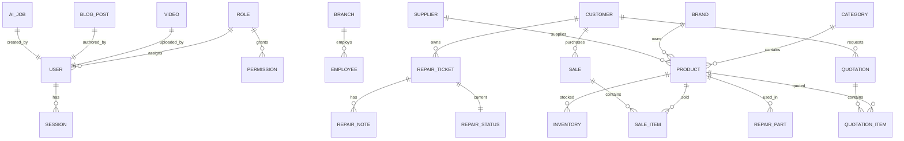

# Stoney Platform Database ERD

## Core Modules

- Authentication
- Organization
- Customers
- Suppliers
- Products
- Inventory
- Repairs
- Sales
- Quotations
- Website CMS
- AI
- System

```mermaid
erDiagram

USER ||--o{ SESSION : has
ROLE ||--o{ USER : assigns
ROLE ||--o{ PERMISSION : grants

BRANCH ||--o{ EMPLOYEE : employs

CUSTOMER ||--o{ REPAIR_TICKET : owns
CUSTOMER ||--o{ SALE : purchases
CUSTOMER ||--o{ QUOTATION : requests

CATEGORY ||--o{ PRODUCT : contains
BRAND ||--o{ PRODUCT : owns

PRODUCT ||--o{ INVENTORY : stocked
PRODUCT ||--o{ REPAIR_PART : used_in
PRODUCT ||--o{ SALE_ITEM : sold
PRODUCT ||--o{ QUOTATION_ITEM : quoted

SUPPLIER ||--o{ PRODUCT : supplies

SALE ||--o{ SALE_ITEM : contains
QUOTATION ||--o{ QUOTATION_ITEM : contains

REPAIR_TICKET ||--o{ REPAIR_NOTE : has
REPAIR_TICKET ||--|| REPAIR_STATUS : current

VIDEO ||--|| USER : uploaded_by
BLOG_POST ||--|| USER : authored_by

AI_JOB ||--|| USER : created_by
```
